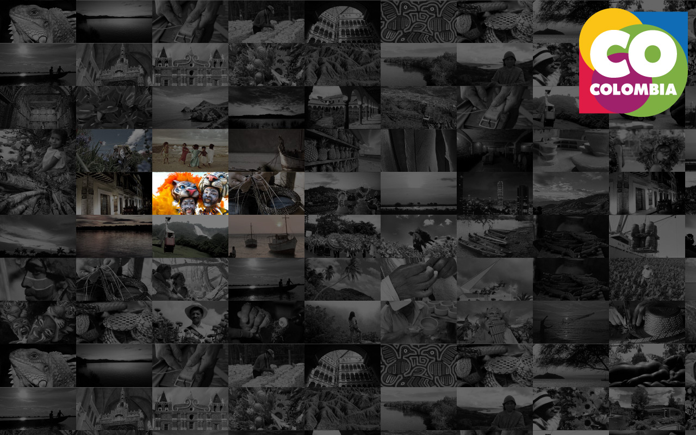

# ColombiaTV-AndroidTV
ColombiaTV is a multimedia project to integrate Colombian live or ondemand contenct to enrich platforms as Kodi, Android and iOS.

This project use the Android TV TIF Framework to integrate Live channels, on-demand content and EPG to TV through streamming o live Channels Input menu. The actual decos does not have any integration to explore the EPG or Picture in Picture options. 

## Install instructions

To set up ColombiaTV on your AndroidTV, follow the next steps
- Open the settings menu.
- Enter the channels options
- Select the Streaming channels setup
- Enter the ColombiaTV service
- Select the setup option

## Screenshots

## Support

ColombiaTV Mastodon microblog: [https://mastodon.cloud/@ColombiaTV](https://mastodon.cloud/@ColombiaTV)

## License

License under the Apache 2.0 license. See the LICENSE file for details.